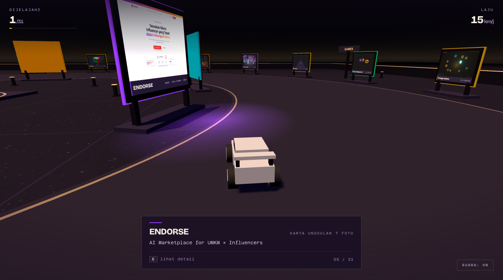

# DIECAST SHOWROOM

Portofolio yang dikendarai. Sebuah balai pamer yang sudah sepi, lampunya masih
menyala, dan 31 proyek berdiri sebagai panel bercahaya — berkendaralah di
antaranya, berhenti di depan salah satunya, dan baca detailnya.
Sembilan karya unggulan punya 5–7 screenshot berlabel yang bisa ditelusuri;
papannya sendiri berganti-ganti foto selama kamu berhenti di depannya.

Datanya bukan salinan manual: ditarik langsung dari
[ghaisansyams.vercel.app](https://ghaisansyams.vercel.app).

Static site murni — tanpa build step, tanpa `npm install`.



## Main

**[ghaisanportofolio-showroom.vercel.app](https://ghaisanportofolio-showroom.vercel.app)**

| Tombol | Fungsi |
| --- | --- |
| `W` `A` `S` `D` | berkendara |
| `E` | buka detail papan terdekat |
| `←` `→` | ganti foto (saat detail terbuka) |
| `Esc` | tutup detail |
| `Space` | rem tangan |
| `R` | balikkan mobil kalau kebalik |

Di HP tombol sentuh muncul otomatis, termasuk tombol **Detail**.

## Kenapa gelap

Ini memakai mobil dan fisika yang sama dengan
[Diecast Rally](https://github.com/ghaisansyams/diecast-rally), jadi keduanya
sengaja dibuat berlawanan supaya tidak terbaca sebagai satu proyek yang sama
di dalam grid portofolio:

| | Diecast Rally | Diecast Showroom |
| --- | --- | --- |
| Waktu | golden hour | sesudah jam tutup |
| Ruang | halaman berpasir terbuka | balai pamer tertutup |
| Lantai | playmat bergaris | teraso gelap mengilap |
| Cahaya | matahari rendah, bayangan panjang | rig langit-langit, bayangan pendek |
| Mobil | mainan merah | show car putih mutiara |
| Pembatas | bergaris merah-putih | dinding gelap dengan rel bercahaya |
| Properti | tembok bata, kerucut, domino | tiang penanda berlampu |

Karena ruangannya gelap, screenshot proyeknya jadi satu-satunya sumber warna
terang — panelnya terbaca sebagai light box, bukan poster di siang hari.

## Tata letak

Dua lingkaran sepusat dengan lajur bercahaya di antaranya:

```
        lingkar luar r=70  —  22 eksperimen, menghadap ke DALAM
   ┌──────────────────────────────────────────┐
   │   lajur r=34..70  ← mobil di sini        │
   │   ┌──────────────────────────────────┐   │
   │   │  lingkar dalam r=34  —  9 karya  │   │
   │   │  unggulan, menghadap ke LUAR     │   │
   │   │        ▲ plaza + monumen         │   │
```

Karena kedua lingkaran menghadap ke lajur, berkendara memutar berarti karya
unggulan di satu sisi dan eksperimen di sisi lain. Papan lingkar luar diurutkan
per kategori (3D & Creative → Games → Web) dengan rambu gerbang di tiap pergantian.

## Galeri foto

Portofolionya menyimpan beberapa screenshot berlabel per karya unggulan —
"Landing", "Dashboard", "AI Matchmaking", dan seterusnya. Totalnya 80 foto:
58 tersebar di 9 karya unggulan, 22 sisanya satu-satu untuk tiap eksperimen.

Semua ikut ditarik. Di panel detail ada galeri lengkap: foto besar, label,
penghitung, panah kiri/kanan, dan deretan thumbnail. Di dunia 3D, papan yang
sedang kamu hadapi berganti foto sendiri dengan crossfade tiap 2.8 detik.

Sinkronisasi menormalkan keduanya jadi satu bentuk — tiap proyek punya array
`shots` berisi `{src, label, blur}`, dan eksperimen yang cuma punya satu gambar
tetap dapat array berisi satu elemen. Penampilnya jadi tidak perlu percabangan.

## Bahasa visual

Dunianya chunky dan terang, jadi antarmukanya sengaja kebalikannya: hairline,
ruang kosong, dan satu garis aksen warna proyek per papan. Tidak ada border
tebal atau hard offset shadow di mana pun — kontras antara mainan dan label
itulah idenya.

Menekan `E` tidak memunculkan modal di tengah layar. Kamera mendekat dan
membingkai papan 3D yang sebenarnya di sisi kiri, lalu panel masuk dari kanan
dengan isinya menyusul bertahap. Kamu membaca sambil menatap benda fisiknya —
dan karena thumbnail galeri juga mengganti foto di papan itu, dua sisi layar
menampilkan screenshot yang sama.

Statistik dipasang sebagai daftar spesifikasi dengan titik-titik penghubung,
bukan grid berkotak. Penomoran "05 / 31" bukan hiasan: itu posisi katalog papan
tersebut di halaman, karya unggulan lebih dulu.

## Sinkronisasi data

```bash
node scripts/sync-portfolio.mjs        # tulis ulang portfolio-data.js
PORTFOLIO_ORIGIN=http://localhost:5173 node scripts/sync-portfolio.mjs
```

Portofolionya SPA Vite tanpa JSON API, jadi datanya dibaca dari bundle yang
ter-deploy. Yang perlu diingat:

**Array dicari lewat tanda tangan isi, bukan nama variabel.** Minifier mengganti
nama tiap build (`fr`, `Af`, `PS` hari ini, entah apa besok), tapi kunci object
literal tidak ikut diganti. Jadi array flagship dikenali karena entrinya punya
`subtitle:`/`year:`/`role:`, dan array more-work karena punya `category:` —
kunci-kunci itu sudah dicek muncul di satu array saja dan tidak pernah di keduanya.

**Kandidat di-bracket-match dulu, baru marker diuji.** Versi pertama menguji
marker pada jendela lebar tetap dari posisi `[{id:"`, dan jendela itu meluber
melewati akhir array kategori yang cuma 4 entri ke array proyek di sebelahnya —
hasilnya array kategori lolos sebagai daftar proyek. Sekarang batas array
ditentukan lebih dulu, marker diuji di dalamnya, lalu tiap entri divalidasi
punya `id` dan `name`.

**Gambar tidak disalin.** Portofolio menyajikannya dengan
`access-control-allow-origin: *`, jadi papan mengambil tekstur langsung dari
sana dan screenshot ikut terbarui tanpa menjalankan ulang script ini. Yang
di-bake cuma teks. Gambar dikecilkan ke lebar 512 px saat masuk — 31 screenshot
ukuran penuh memakan sekitar 150 MB memori GPU.

## Stack

- **three.js r128** dan **cannon.js 0.6.2** dari cdnjs, keduanya build UMD
- `RaycastVehicle` yang sama dengan [Diecast Rally](https://github.com/ghaisansyams/diecast-rally)
- Satu `index.html` + `portfolio-data.js` hasil generate. Tanpa framework.

## Catatan teknis

**Titik spawn dihitung, bukan ditebak.** Titik baca tiap papan ada 7.5 m di
depannya, dan radius fokus 13 m. Di boulevard, jarak ke titik baca lingkar dalam
dan lingkar luar nyaris sama, jadi hampir semua posisi awal membuat mobil sudah
"membaca" papan sebelum pemain bergerak. Sudut 140° pada r=47.5 dicari secara
numerik terhadap seluruh 31 titik baca: jarak terdekatnya 16.5 m.

**Perpindahan fokus pakai histeresis.** Garis tengah boulevard berjarak sama ke
kedua lingkaran, jadi aturan "yang terdekat menang" membuat fokus berkedip antar
papan tiap frame. Penantang baru harus setidaknya 28% lebih dekat untuk merebut.

**Galeri dibatasi dua proyek di memori GPU.** 80 screenshot yang semuanya
resident memakan sekitar 70 MB. Jadi saat start hanya foto sampul tiap proyek
yang dimuat (31 tekstur); sisanya menyusul hanya untuk papan yang sedang
difokus, dan cuma dua proyek terakhir yang galerinya disimpan — selebihnya
dilepas kembali ke foto sampul. Ada jeda 1.2 detik sebelum pemuatan dimulai,
supaya sekadar melintas tidak memicu unduhan.

**Lapisan crossfade disembunyikan saat menganggur.** Papan punya dua plane:
satu untuk foto sekarang, satu untuk foto berikutnya yang memudar di atasnya.
Material `transparent` tetap dirender three.js walaupun `opacity` 0, jadi 31
lapisan itu sempat menambah overdraw percuma sebelum `visible = false`.

**Bingkai galeri 16:10, bukan 16:8 dengan `cover`.** Sumbernya 1600×1000
hampir seragam. Versi awal memakai bingkai lebih pendek dengan `object-fit:
cover`, yang memotong bagian bawah tiap screenshot — hal terakhir yang pantas
dilakukan portofolio pada karyanya sendiri.

**Mobil pemain tidak boleh tidur.** cannon memarkir sebuah body setelah satu
detik simulasi di bawah ambang kecepatan, dan body yang tidur mengabaikan
impuls yang diberikan `RaycastVehicle` — gas jadi tidak berefek sampai ada yang
memanggil `wakeUp()`. Satu-satunya `wakeUp()` di file ini ada di dalam
`placeCar()`, yang persis dipanggil oleh tombol `R`; itulah kenapa dulu mobil
seolah harus "dibangunkan" dengan R sebelum WASD berfungsi. Sekarang sasisnya
`allowSleep = false`, `startRun()` mengembalikan mobil ke spawn saat run dimulai
(seperti yang sudah dilakukan Diecast Rally sejak awal), dan tombol arah apa pun
memanggil `wakeUp()` sebagai pengaman.

**Image-based lighting dibuang setelah membuat lantai jadi putih total.**
`PMREMGenerator.fromScene()` di atas kubah langit menghasilkan environment map
yang membakar seluruh lantai — seluruh paruh bawah layar putih polos. Tanpa
environment, `metalness` cuma membuat permukaan lebih gelap karena tidak ada
yang bisa dipantulkan, jadi semua material sekarang nyaris dielektrik
(`metalness` ≤ 0.08) dan kilapnya datang dari sorotan spekular lampu rig.

**Matahari diturunkan untuk bayangan golden-hour** — catatan ini berlaku untuk
versi halaman terbuka sebelumnya; sekarang lampunya justru dipasang curam. Sudut elevasinya sekitar
24°, jadi bayangan memanjang menyapu aspal. Konsekuensinya cahaya yang jatuh di
tanah datar berkurang separuh (`NdotL` 0.82 → 0.41), jadi intensitas matahari
ikut dinaikkan supaya pasirnya tidak berubah keruh. Kotak shadow camera juga
dilebarkan ke ±38 karena bayangan sepanjang itu tak lagi muat di ±30.

**Panel mobile sempat meluber 28 px di bawah layar.** Aturan di media query
`.veil:not(.intro) .sheet` punya spesifisitas persis sama dengan
`.veil.open .sheet` tapi ditulis belakangan, jadi offset masuk
`translateY(28px)` tidak pernah dibatalkan saat panel terbuka. Keadaan terbuka
harus dinyatakan ulang di dalam media query itu.

**Nameplate digambar ulang setelah webfont mendarat.** Teks canvas diukur dengan
font yang siap saat itu juga, jadi tanpa `document.fonts.ready` semua nameplate
akan ter-render dengan font fallback.
